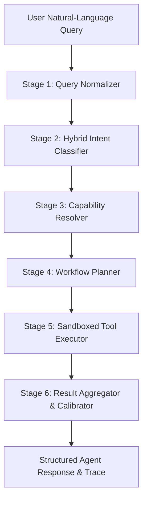

# SatQuery AI — Agentic Multimodal Orchestration

**Project:** SatQuery AI  
**Subsystem:** Agentic Controller (`backend/app/agent/`)  
**Design Pattern:** 5-Stage Deterministic Agent Pipeline (Normalize -> Classify -> Resolve -> Plan -> Execute -> Aggregate)

---

## 1. Architectural Philosophy

Traditional Large Language Model (LLM) agents often rely on unconstrained tool generation (ReAct loops, autonomous reflection, or dynamic code execution). In high-consequence remote sensing workflows, this introduces hallucinations, non-deterministic latency, and dangerous execution paths.

SatQuery AI implements a **deterministic, auditable agent pipeline**:
- Every step is strictly bounded by a typed contract.
- The agent selects exclusively from a pre-registered, static `ToolRegistry`.
- Parameter schemas are strictly validated before plan issuance.
- No dynamic code execution (`eval()`, `exec()`, or sub-shell) is permitted.

---

## 2. The 5-Stage Agent Pipeline



### Stage 1: Query Normalization (`QueryNormalizer`)
- Collapses consecutive whitespace, tabs, and linebreaks into single spaces.
- Strips leading and trailing punctuation noise while preserving domain-specific tokens.
- Lowercases query text for rule matching while retaining original casing for display.

### Stage 2: Hybrid Intent Classification (`QueryClassifier`)
Combines lexical pattern matching, question syntax analysis, and input context (image count and modalities) into an auditable classification decision:

| Intent Category | Trigger Patterns & Rules | Input Context Constraints | Target Tool |
| :--- | :--- | :--- | :--- |
| **`VISUAL_QUESTION_ANSWERING`** | Interrogative syntax (`what`, `is there`, `count`, `how many`, `classify`) | 1 Image | `single_image_vqa` |
| **`SCENE_DESCRIPTION`** | Imperative caption keywords (`describe`, `overview`, `summarize`, `caption`) | 1 Image | `single_image_caption` |
| **`GROUNDING`** | Spatial directives (`highlight`, `locate`, `outline`, `bounding box`, `where is`) | 1 Image | `single_image_grounding` |
| **`CHANGE_ANALYSIS`** | Temporal keywords (`what changed`, `difference between`, `before and after`, `two dates`) | $\ge 2$ Images ($T_1, T_2$) or `pair_id` | `bi_temporal_change_detection` / `bi_temporal_change_vqa` |
| **`CROSS_MODAL_ANALYSIS`** | Multi-sensor keywords (`optical and sar`, `fuse`, `radar and optical`, `both modalities`) | $\ge 2$ Images (Optical + SAR) or `pair_id` | `optical_sar_analysis` / `optical_sar_vqa` |
| **`AMBIGUOUS`** | Vague phrases (`tell me about this`, `what is this`, `analyze this`, `info`) | Any | Prompt for clarification |
| **`UNKNOWN`** | Empty query or uninterpretable token stream | Any | Prompt for input |

### Stage 3: Capability Resolution (`CapabilityResolver`)
Validates that physical imagery matches the classified task:
- If `CHANGE_ANALYSIS` is requested with only 1 image: fails closed with `status="unavailable"` and returns: *"Change analysis requires at least two images acquired at different dates ($T_1$ and $T_2$)."*
- If `CROSS_MODAL_ANALYSIS` is requested without both optical and SAR imagery: returns explicit sensor requirement warning.
- Ensures requested tool is registered and marked `status="available"`.

### Stage 4: Workflow Planning (`WorkflowPlanner`)
Constructs a single- or multi-step execution plan represented as `WorkflowPlanSchema`:
```python
class PlanStepSchema(BaseModel):
    tool: str
    task: str
    parameters: Dict[str, Any]
```
Enforces strict parameter sanitization: validates image UUIDs, strips unpermitted parameters, and checks input schemas against tool definitions.

### Stage 5: Sandboxed Tool Execution (`ToolExecutor`)
- Retrieves the tool singleton from `ToolRegistry`.
- Executes `tool.execute(input_context, parameters, db)` inside an asynchronous context.
- Traps typed exceptions (`ModelUnavailableError`, `StorageObjectNotFoundError`, `AlignmentError`) and maps them to clean HTTP status codes instead of generic 500 crashes.

### Stage 6: Result Aggregation (`ResultAggregator`)
- Harmonizes raw model outputs into a unified answer payload.
- Calculates the calibrated confidence score ($0.0 – 1.0$) and categorical label (`high`, `medium`, `low`).
- Classifies outputs into the tripartite observation taxonomy (`observed`, `inferred`, `uncertain`).
- Attaches linked evidence artifact IDs for visual rendering.

---

## 3. Tool Registry Architecture

`ToolRegistry` (`backend/app/tools/registry.py`) maintains the complete list of authorized tools:

```python
_tool_registry = ToolRegistry()
_tool_registry.register(SingleImageVQATool())
_tool_registry.register(SingleImageCaptionTool())
_tool_registry.register(SingleImageGroundingTool())
_tool_registry.register(BiTemporalChangeDetectionTool())
_tool_registry.register(BiTemporalChangeVQATool())
_tool_registry.register(ChangeDescriptionTool())
_tool_registry.register(OpticalSARAnalysisTool())
_tool_registry.register(OpticalSARVQATool())
_tool_registry.register(OpticalSARGroundingTool())
```

---

## 4. Execution Trace & Observability

Every agent run creates an `agent_runs` record and detailed microsecond events in `agent_trace_events`:

```json
{
  "agent_run_id": "9b12e345-f678-490a-bcde-1234567890ab",
  "total_duration_ms": 342,
  "events": [
    {
      "milestone": "query_received",
      "timestamp_ms": 10,
      "details": {"query_length": 56}
    },
    {
      "milestone": "intent_classified",
      "intent": "VISUAL_QUESTION_ANSWERING",
      "confidence": 0.93,
      "timestamp_ms": 25
    },
    {
      "milestone": "capability_resolved",
      "tool": "single_image_vqa",
      "timestamp_ms": 30
    },
    {
      "milestone": "plan_generated",
      "steps": 1,
      "timestamp_ms": 35
    },
    {
      "milestone": "tool_executed",
      "tool": "single_image_vqa",
      "duration_ms": 280,
      "timestamp_ms": 315
    },
    {
      "milestone": "aggregation_complete",
      "confidence": 0.88,
      "timestamp_ms": 342
    }
  ]
}
```

The execution trace is displayed live in the web interface via the **Technical Trace** component (`frontend/components/technical-trace.tsx`).
