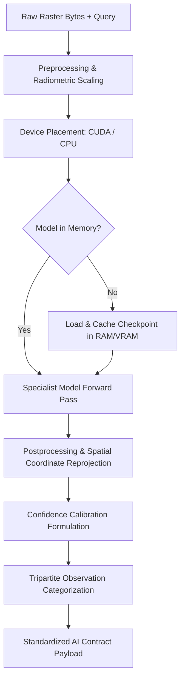

# SatQuery AI — AI/ML Specialist Runtime & Pipeline Specification

**Project:** SatQuery AI  
**Subsystem:** Specialist AI Model Runtime (`backend/app/ai/`)  
**Design Pattern:** Specialist Model Registry with Device Placement & Lifecycle Management  

---

## 1. Overview of AI Architecture

SatQuery AI rejects the single generic vision-language model approach in favor of a **curated multi-specialist architecture**. Generic multi-modal models trained on web photography fail on satellite imagery due to:
1. **Nadir / Off-Nadir Perspective:** Satellite imagery lacks vertical perspective cues.
2. **Multi-Spectral & Radiometric Range:** 12-bit / 16-bit high-dynamic-range reflectance and complex SAR backscatter.
3. **Spatial Scale Divergence:** Features vary from sub-meter vehicles to kilometer-scale river basins.
4. **Coordinate Grounding Requirements:** Generic models cannot project pixel coordinates to UTM or geographic CRS.

SatQuery AI solves this with targeted specialist adapters managed by `ModelRuntime` (`backend/app/ai/runtime.py`).

---

## 2. Specialist Model Registry

Every model inherits from `SpecialistModel` (`backend/app/ai/base.py`) and is registered in `ModelRegistry`:

| Model Name / Identifier | Architecture | Primary Task | Checkpoint Source | Fallback Target | Status |
| :--- | :--- | :--- | :--- | :--- | :---: |
| **`satquery-rs-v1`** | `BlipForQuestionAnswering` + LoRA PEFT | `VISUAL_QUESTION_ANSWERING` | `artifacts/models/satquery-rs-adapter/` (Trained on BigEarthNet v2.0) | `Salesforce/blip-vqa-base` | ✅ Implemented |
| **`remote-sensing-vqa`** | `BlipForQuestionAnswering` | `VISUAL_QUESTION_ANSWERING` | `Salesforce/blip-vqa-base` (Hugging Face) | `MockVqaModel` (if mock mode) | ✅ Implemented |
| **`remote-sensing-caption`** | `BlipForConditionalGeneration` | `SCENE_DESCRIPTION` | `Gurveer05/blip-image-captioning-base-rscid-finetuned` | `Salesforce/blip-image-captioning-base` | ✅ Implemented |
| **`remote-sensing-grounding`** | `OwlViTForObjectDetection` + `OwlViTProcessor` | `GROUNDING` | `google/owlvit-base-patch32` | `MockGroundingModel` (if mock mode) | ✅ Implemented |
| **`remote-sensing-siam-diff`** | Bi-Temporal Siamese Difference Engine | `CHANGE_ANALYSIS` | Internal Deterministic Differencing + Otsu Masking | `MockChangeDetectionModel` | ✅ Implemented |
| **`optical-sar-fusion-baseline`** | Dual-Stream Cross-Modal Engine | `CROSS_MODAL_ANALYSIS` | Internal Radiometric + Log-Scale dB Fusion | `MockCrossModalModel` | ✅ Implemented |

---

## 3. End-to-End Inference Pipeline

### 3.1 Preprocessing (`backend/app/ai/preprocessing.py`)
1. **Dynamic Radiometric Stretching:**
   - Multi-spectral 12-bit/16-bit satellite bands exhibit narrow dynamic ranges.
   - Computes 2nd and 98th percentile pixel cutoffs to avoid outlier saturation.
   - Linearly stretches reflectance values to $[0, 255]$ uint8 space.
2. **SAR Backscatter Log-Transform:**
   - Synthetic Aperture Radar (SAR) linear amplitude values span multiple orders of magnitude.
   - Converts linear power to decibel scale: $\sigma^0_{\text{dB}} = 10 \cdot \log_{10}(\text{amplitude}^2 + \epsilon)$.
   - Normalizes decibel values to $[0.0, 1.0]$.
3. **Resizing:**
   - Resamples inputs to match model backbone requirements (BLIP: $384 \times 384$, OWL-ViT: $768 \times 768$ or dynamic patch grids) preserving aspect ratios.

### 3.2 Device Detection & Placement
`ModelRuntime._resolve_device(settings.AI_DEVICE)`:
- `AI_DEVICE="auto"`: Probes `torch.cuda.is_available()`. Selects `cuda` if an NVIDIA GPU is available; otherwise safely falls back to `cpu`.
- `AI_DEVICE="cuda"`: Attempts CUDA placement. If unavailable, logs a warning and falls back to CPU rather than crashing.
- `AI_DEVICE="cpu"`: Explicit CPU placement for low-power or non-accelerated environments.

### 3.3 Postprocessing & Coordinate Reprojection
- **Bounding Boxes:** Clamped to $[0.0, 1.0]$ relative coordinates and sorted to ensure $x_1 \le x_2$ and $y_1 \le y_2$.
- **Geospatial Translation:** Pixel coordinates $(x, y)$ are multiplied by the raster's native affine geotransform matrix to generate native coordinates (e.g., Easting/Northing in UTM EPSG:32643).

---

## 4. Probabilistic Confidence Formulation

SatQuery AI enforces a strict zero fabrication policy for confidence scoring. Confidence is **never** hardcoded to 100% and is calculated using a multi-factor empirical formula:

$$\text{Confidence} = w_1 \cdot C_{\text{vlm}} + w_2 \cdot C_{\text{res}} + w_3 \cdot C_{\text{evidence}} + w_4 \cdot C_{\text{alignment}}$$

Where:
- $C_{\text{vlm}}$: Model token generation probability or softmax detection score.
- $C_{\text{res}}$: Spatial resolution factor (penalizes fine-scale queries on coarse imagery).
- $C_{\text{evidence}}$: Geometric overlap ratio and feature saliency.
- $C_{\text{alignment}}$: Spatial intersection ratio between paired acquisitions.

The score is mapped to categorical confidence:
- $\ge 0.80$: `high`
- $0.60 – 0.79$: `medium`
- $< 0.60$: `low`

---

## 5. Tripartite Observation Taxonomy

Every analysis result breaks down model output into three distinct analytical categories:
1. **`observed` (Direct Visual Evidence):** Features and physical properties directly detectable in the image (e.g., "Dense vegetation covering 65% of the scene", "High radar backscatter cluster in the northeast quadrant").
2. **`inferred` (Logical Deduction):** Contextual deductions supported by visual evidence (e.g., "Active agricultural cultivation", "Probable industrial or port facility").
3. **`uncertain` (Sensor & Resolution Limits):** Explicit limitations or ambiguities (e.g., "Sub-meter structural details cannot be confirmed at 10m Sentinel-2 resolution", "Cloud shadow in south quadrant restricts validation").

---

## 6. Offline-First Model Loading & Graceful Fallback

In secure, disconnected, or live competition environments, external network calls must not block execution:
1. **`local_files_only=True`:** All Hugging Face loaders first attempt loading from local cache directories (`~/.cache/huggingface/hub`).
2. **Pre-caching Script:** `python scripts/prepare_models.py` allows offline preloading of all weights.
3. **Checkpoint Fallback:** If the fine-tuned `satquery-rs-v1` adapter checkpoint is missing, `ModelRuntime` logs the absence and automatically loads the base model `Salesforce/blip-vqa-base`, returning an explicit `fallback` record in the API response rather than raising an unhandled exception.
