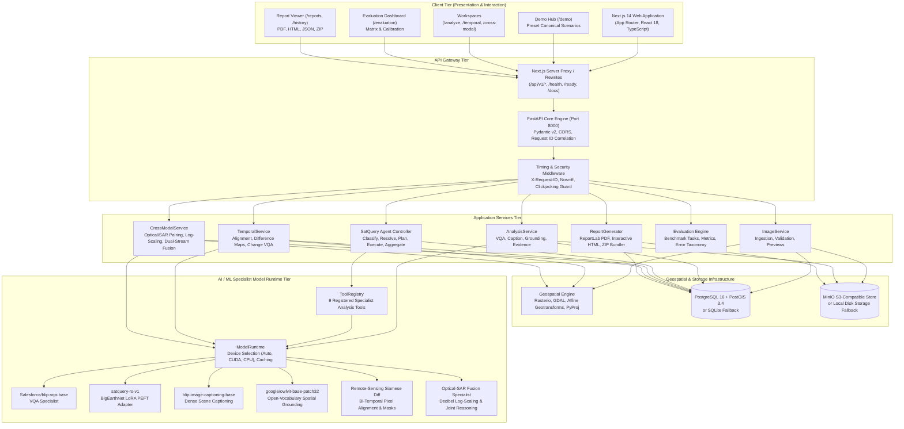
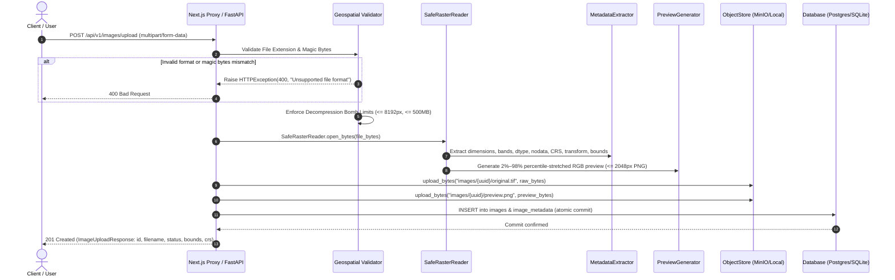
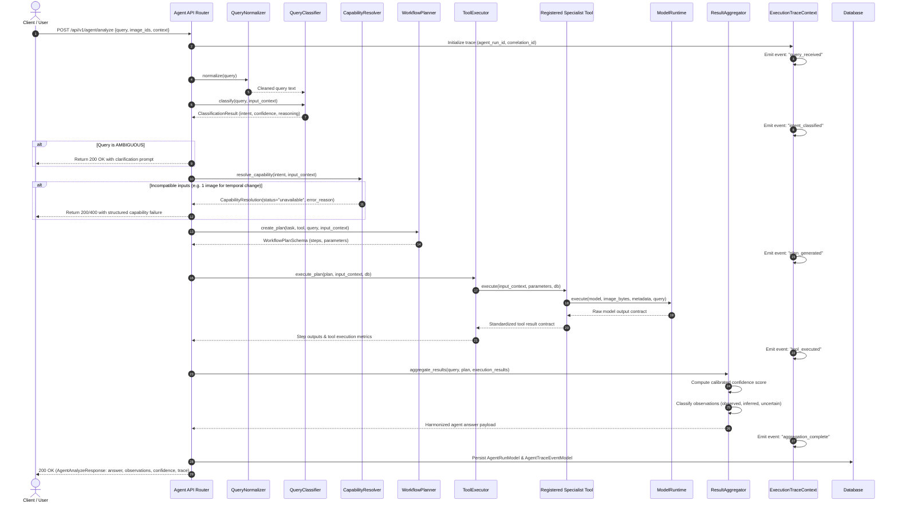

# SatQuery AI — System Architecture Specification

**Project:** SatQuery AI  
**Scope:** Autonomous Vision-Language Assistant for Multimodal Remote Sensing Image Analysis  
**Specification:** ISRO / Smart India Hackathon Problem Statement 26167  
**Architecture Version:** 1.0.0 (Production Verified)

---

## 1. System Topology Overview

SatQuery AI is architectured as a multi-tier, decoupled geospatial and vision-language intelligence platform:

---

## 2. Ingestion & Geospatial Request Lifecycle

When a remote-sensing raster file is submitted to `POST /api/v1/images/upload`:

---

## 3. Agentic Query Request Lifecycle

When a natural-language query is submitted to `POST /api/v1/agent/analyze`:

---

## 4. Layer Responsibilities & Source Code Traceability

| Architectural Layer | Repository Path | Primary Modules | Core Responsibilities |
| :--- | :--- | :--- | :--- |
| **Frontend Application** | `frontend/` | `app/page.tsx`, `app/demo/`, `app/analyze/`, `components/` | Client-side routing, interactive satellite imagery viewing, canvas bounding box rendering, bitemporal split-screen comparison, optical-SAR dual viewing, multi-format report exports. |
| **API Gateway & Routing** | `backend/app/api/` | `__init__.py`, `health.py`, `images.py`, `analysis.py`, `agent.py`, `temporal.py`, `cross_modal.py`, `evaluation.py`, `reports.py` | FastAPI endpoint definitions, input parameter validation, dependency injection (`get_db`), HTTP error code mapping, response serialization. |
| **Geospatial Processing Engine** | `backend/app/geospatial/` | `reader.py`, `metadata.py`, `normalization.py`, `preview.py`, `validator.py` | Rasterio-based safe reading, native CRS and affine geotransform extraction, high-dynamic-range radiometric stretching (2%–98%), browser-friendly preview creation, decompression bomb defenses. |
| **Agentic Controller** | `backend/app/agent/` | `controller.py`, `classifier.py`, `resolver.py`, `planner.py`, `executor.py`, `aggregator.py`, `trace.py` | Query normalization, hybrid keyword/regex/context intent classification, deterministic capability resolution, sandboxed tool dispatch, observation categorization, execution trace collection. |
| **Tool Registry** | `backend/app/tools/` | `registry.py`, `base.py`, `vqa.py`, `caption.py`, `grounding.py`, `change_detection.py`, `change_vqa.py`, `change_description.py`, `optical_sar_analysis.py`, `optical_sar_vqa.py`, `optical_sar_grounding.py` | Explicit registration of 9 verified analysis tools, input pre-validation, task indexing, sandboxed execution without arbitrary code execution. |
| **AI Specialist Runtime** | `backend/app/ai/` | `runtime.py`, `registry.py`, `base.py`, `preprocessing.py`, `postprocessing.py`, `models/` | Hardware device auto-detection (`cuda` vs `cpu`), model lifecycle management, in-memory model caching, execution timing instrumentation, graceful fallback to base models if checkpoints are missing. |
| **Temporal Change Engine** | `backend/app/temporal/` | `alignment.py`, `change_map.py`, `change_vqa.py`, `compatibility.py`, `description.py`, `regions.py`, `service.py`, `validator.py` | Pair registration ($T_1 < T_2$), spatial overlap calculation, bilinear grid resampling, difference matrix generation, change percentage calculation, connected component polygonization. |
| **Cross-Modal Fusion Engine** | `backend/app/cross_modal/` | `alignment.py`, `compatibility.py`, `fusion.py`, `reasoning.py`, `service.py`, `validator.py` | Optical vs. SAR modality detection, log-scale decibel backscatter normalization, dual-stream feature fusion, joint observation synthesis, sensor conflict/disagreement detection. |
| **Evidence Engine** | `backend/app/evidence/` | `artifacts.py`, `geometry.py`, `overlay.py`, `renderer.py` | Bounding box normalization $[ymin, xmin, ymax, xmax]$, pixel-to-geographic coordinate reprojection, binary mask generation, visual overlay rendering, evidence crop artifact storage. |
| **Storage Layer** | `backend/app/storage/` | `object_store.py`, `exceptions.py` | Abstract `ObjectStore` interface supporting MinIO (S3-compatible) and local filesystem fallback, path traversal defense, typed `StorageObjectNotFoundError`. |
| **Database Tier** | `backend/app/database/` | `models.py`, `session.py`, `alembic/` | PostgreSQL 16 with PostGIS 3.4 (with SQLite fallback for local dev), 8 SQLAlchemy async models, self-healing startup column synchronization, Alembic migration scripts. |
| **Report Engine** | `backend/app/reports/` | `generator.py`, `pdf_exporter.py`, `html_exporter.py`, `json_exporter.py`, `package_exporter.py` | Compiles analysis records, metadata, evidence crops, and execution traces into formal vector PDF (ReportLab), self-contained interactive HTML, machine-readable JSON, and deliverable ZIP bundles. |
| **Evaluation Framework** | `evaluation/` | `run.py`, `compare.py`, `core/`, `datasets/`, `tasks/` | Multi-dataset benchmark harness (BigEarthNet, VRSBench, RSVQA, CDVQA, ISRO/SAC), standard metric calculations (EM, F1, BLEU-4, ROUGE-L, IoU, ECE, Brier Score), zero fabrication reporting. |
| **Domain Adaptation Pipeline** | `training/` | `train_rs_adapter.py`, `peft_adapter.py`, `adapter_validation.py`, `configs/rs_adapter.yaml` | BigEarthNet v2.0 dataset loader, PEFT/LoRA fine-tuning for Vision-Language Models, data leakage quarantine, adapter checkpoint generation (`artifacts/models/satquery-rs-adapter`). |

---

## 5. Security & Isolation Architecture

1. **Path Traversal Guard:**
   - User-supplied filenames are never used as physical storage keys.
   - Storage keys strictly follow randomized UUID schemes: `images/{uuid}/original.tif`, `images/{uuid}/preview.png`, `evidence/{uuid}/crop.png`.
   - The storage layer resolves paths against the canonical base directory and asserts that resolved paths begin with the base directory path.

2. **Decompression Bomb Defense:**
   - Maximum upload size is strictly capped at `MAX_UPLOAD_SIZE_MB` (default 500 MB).
   - Raster dimensions are verified before uncompressed allocation: width and height must not exceed 8,192 pixels, and total uncompressed pixel count must not exceed 67,108,864 pixels.

3. **Deterministic Sandbox Execution:**
   - The agentic controller dispatches requests strictly to pre-registered instances in `ToolRegistry`.
   - No Python `eval()`, `exec()`, or sub-shell invocation exists anywhere in the agent dispatch pipeline.

4. **Masked Internal Errors:**
   - Unhandled server exceptions are trapped by global FastAPI handlers and converted to structured JSON envelopes.
   - Database credentials, internal file paths, and raw stack traces are masked, returning only a unique `trace_id` for administrative log correlation.
