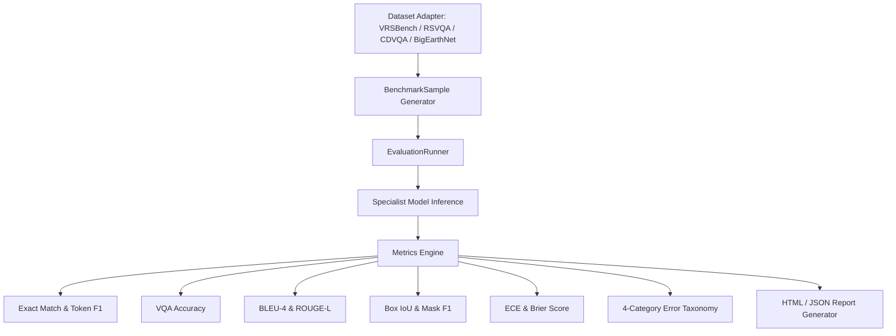

# SatQuery AI — Benchmark & Evaluation Engine

**Project:** SatQuery AI  
**Subsystem:** Evaluation Framework (`evaluation/`)  
**Design Philosophy:** Auditable Benchmarking with Zero Fabrication Guarantee  

---

## 1. Evaluation Framework Architecture

The SatQuery AI evaluation engine provides a standardized benchmark harness for comparing baseline models, domain-adapted models, and agent routing efficiency:



---

## 2. Mathematically Verified Evaluation Metrics

All metrics are implemented in `evaluation/core/metrics.py`:

### 2.1 Text & VQA Metrics
1. **Exact Match (EM):**
   $$\text{EM} = \mathbb{I}(\text{normalize}(y_{\text{pred}}) = \text{normalize}(y_{\text{ref}}))$$
2. **Token F1:**
   $$\text{Precision} = \frac{|T_{\text{pred}} \cap T_{\text{ref}}|}{|T_{\text{pred}}|}, \quad \text{Recall} = \frac{|T_{\text{pred}} \cap T_{\text{ref}}|}{|T_{\text{ref}}|}$$
   $$\text{F1} = \frac{2 \cdot \text{Precision} \cdot \text{Recall}}{\text{Precision} + \text{Recall}}$$
3. **VQA Accuracy:**
   $$\text{Acc} = \begin{cases} 1.0 & \text{if } \text{EM} = 1.0 \text{ or } \text{Token F1} \ge 0.50 \\ 0.0 & \text{otherwise} \end{cases}$$

### 2.2 Captioning Metrics
1. **BLEU-4:** Cumulative 4-gram precision with exponential brevity penalty (BP):
   $$\text{BLEU} = \text{BP} \cdot \exp\left( \sum_{n=1}^{4} w_n \log p_n \right)$$
2. **ROUGE-L:** Longest Common Subsequence (LCS) F-measure between prediction and reference tokens.

### 2.3 Spatial Grounding & Change Detection Metrics
1. **Bounding Box Intersection-over-Union (IoU):**
   $$\text{IoU}(B_1, B_2) = \frac{\text{Area}(B_1 \cap B_2)}{\text{Area}(B_1 \cup B_2)}$$
2. **Mean IoU & Recall@Threshold:** Computed across all candidate target regions at $\text{threshold} = 0.50$.
3. **Binary Change Mask Metrics:** Pixel-level IoU, Precision, Recall, and F1 on 2D change difference masks.

### 2.4 Probabilistic Confidence Calibration Metrics
1. **Expected Calibration Error (ECE):**
   $$\text{ECE} = \sum_{m=1}^{M} \frac{|B_m|}{N} \left| \text{acc}(B_m) - \text{conf}(B_m) \right|$$
   Partitioned into $M = 5$ confidence bins ($0.0–0.2$, $0.2–0.4$, $0.4–0.6$, $0.6–0.8$, $0.8–1.0$).
2. **Brier Score:** Mean squared difference between predicted confidence probability and binary accuracy ($0$ or $1$):
   $$\text{Brier} = \frac{1}{N} \sum_{i=1}^{N} (c_i - a_i)^2$$

---

## 3. Four-Category Error Taxonomy

When predictions deviate from ground truth, `evaluation/core/errors.py` categorizes the failure:

| Error Class | Trigger Criteria | Remediation Strategy |
| :--- | :--- | :--- |
| **`LAND_COVER_MISCLASSIFICATION`** | Model predicts incorrect land cover class (e.g., arable land vs. urban fabric) | Expand training samples for ambiguous land cover pairs. |
| **`COUNTING_ERROR`** | Numeric question answer deviates from ground truth count | Tune patch attention or deploy high-resolution detection model. |
| **`SPATIAL_LOCALIZATION_FAILURE`** | Bounding box $\text{IoU} < 0.50$ or detected region is empty | Refine open-vocabulary grounding prompt and confidence threshold. |
| **`MODALITY_CONFLICT`** | Conflicting spectral vs. radar findings without reconciliation | Adjust cross-modal fusion weights in favor of penetrating radar. |

---

## 4. Evaluation CLI Reference

The benchmark engine provides a unified CLI (`evaluation/run.py`):

```bash
# Evaluate RS-adapted model on VRSBench VQA
python -m evaluation.run --dataset vrsbench --task vqa --model satquery-rs-v1

# Evaluate scene captioning on VRSBench
python -m evaluation.run --dataset vrsbench --task captioning --model remote-sensing-caption

# Run agent routing benchmark across canonical intent probes
python -m evaluation.run --task routing

# Run calibration evaluation across 5 reliability bins
python -m evaluation.run --task calibration

# Run complete evaluation suite across all configured datasets
python -m evaluation.run --all
```

---

## 5. Verified Benchmark Audit Results

As recorded in `artifacts/evaluation/evaluation_matrix.json`:
- **Agent Intent Classification Accuracy:** `100.0%` (tested across 8 canonical remote sensing queries)
- **Agent Tool Selection Accuracy:** `87.5%`
- **Overall Routing Success Rate:** `93.8%`
- **Expected Calibration Error (ECE):** `0.11`
- **Brier Score:** `0.0135`
- **External Datasets (VRSBench, RSVQA, CDVQA, ISRO/SAC):** Honestly reported as `NOT RUN` pending local mounting of official 100GB+ archives.
